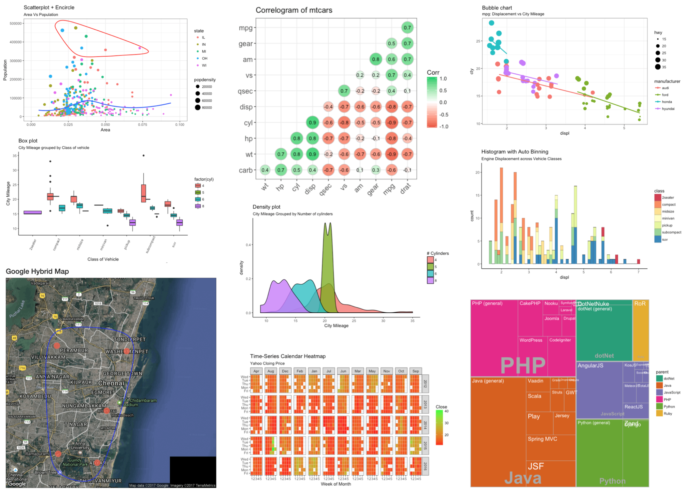
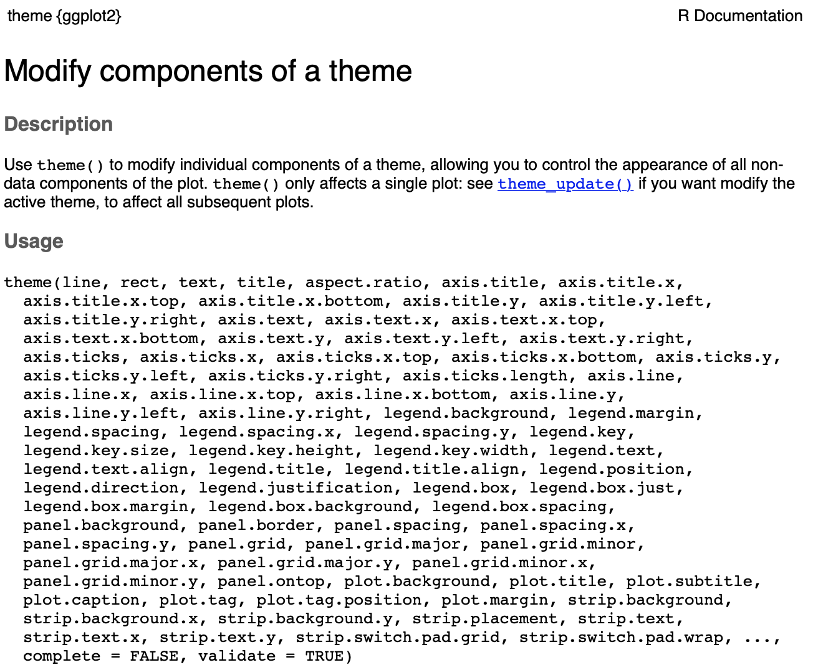

layout: true

<div class="my-footer">
  <span style="text-align:center">
    <span> 
      
    </span>
    <a href="https://cdsbasel.github.io/dataanalytics/">
      <span style="padding-left:82px"> 
        <font color="#7E7E7E">
          cdsbasel.github.io/dataanalytics/
        </font>
      </span>
    </a>
    <a href="https://cdsbasel.github.io/dataanalytics/">
      <font color="#7E7E7E">
       Data Analytics for Psychology and Business | February 2019
      </font>
    </a>
    </span>
  </div> 

---


```{r, eval = TRUE, echo = FALSE, warning=F,message=F}
# Code to knit slides
baselers <- readr::read_csv("1_Data/basel.csv")
```


```{r setup, include=FALSE}
options(htmltools.dir.version = FALSE)
# see: https://github.com/yihui/xaringan
# install.packages("xaringan")
# see: 
# https://github.com/yihui/xaringan/wiki
# https://github.com/gnab/remark/wiki/Markdown
options(width=110)
options(digits = 4)
```

```{r, echo = FALSE ,message = FALSE, warning = FALSE}
knitr::opts_chunk$set(comment=NA, fig.width=6, fig.height=6, echo = TRUE, eval = TRUE, 
                      message = FALSE, warning = FALSE, fig.align = 'center', dpi = 200)
library(tidyverse)
library(ggthemes)
basel = read_csv('1_Data/basel.csv')
```


<p align="center">
<br>

<br>
<font style="font-size:10px">from <a href="http://r-statistics.co/Top50-Ggplot2-Visualizations-MasterList-R-Code.html">r-statistics.co</a></font>
</p>


---


.pull-left4[

# `base` Plotting

<ul>
  <li class="m1"><span>The <high>traditional</high> approach for plotting.</span></li>
  <li class="m2"><span><high>Separate functons</high> for different plots</span></li>
</ul>

<br>

```{r, eval = FALSE}
# Histogram in base R
hist(x = basel$alter,
     xlab = "Alter",
     ylab = "Häufigkeit",
     main = "Histogramm Alter")
```

]

.pull-right5[
<br><br><br>
```{r, echo = F}
# Histogram in base R
hist(x = basel$alter,
     xlab = "Alter",
     ylab = "Häufigkeit",
     main = "Histogramm Alter")
```

]


---


.pull-left4[

# `base` Plotting

<ul>
  <li class="m1"><span>The <high>traditional</high> approach for plotting.</span></li>
  <li class="m2"><span><high>Separate functons</high> for different plots</span></li>
</ul>

<br>


```{r, eval = F}
# Boxplot in base R
boxplot(formula = groesse ~ geschlecht,
        data = basel,
        xlab = "Geschlecht",
        ylab = "Groesse",
        main = "Box plot Groesse")
```

]

.pull-right5[
<br><br><br>
```{r, echo = F}
# Boxplot in base R
boxplot(formula = groesse ~ geschlecht,
        data = basel,
        xlab = "Geschlecht",
        ylab = "Groesse",
        main = "Box plot Groesse")
```

]

---


.pull-left4[

# `base` Plotting

<ul>
  <li class="m1"><span>The <high>traditional</high> approach for plotting.</span></li>
  <li class="m2"><span><high>Separate functons</high> for different plots</span></li>
</ul>

<br>


```{r, eval = F}
# Scatterplot in base R
plot(x = basel$groesse,
     y = basel$einkommen,
     xlab = "Height",
     ylab = "Einkommen",
     main = "Scatterplot Groesse x Einkommen")
```

]

.pull-right5[
<br><br><br>
```{r, echo = F}
# Scatterplot in base R
plot(x = baselers$groesse,
     y = baselers$einkommen,
     xlab = "Groesse",
     ylab = "Einkommen",
     main = "Scatterplot Groesse x Einkommen")
```

]


---

# Probleme mit Base R plotting

.pull-left4[

<ul>
  <li class="m1"><span><high>Aesthetics</high> are outdated.</span></li>
  <li class="m2"><span>Pretty plots = <high>lots of code.</high></span></li>
  <li class="m3"><span>Relatively <high>inflexible</high>.</span></li>
</ul>
]

.pull-right5[

<p align="center">
<br>

<br>
<font style="font-size:10px">from <a href="https://www.healthhosts.com/4-signs-your-website-is-outdated/">healthhosts.com</a></font>
</p>

]

---

# The mighty `tidyverse`

The [`tidyverse`](https://www.tidyverse.org/) is a collection of high-performing, user-friendly R packages, created explicitly for efficient data analytics. 
1. <high><mono>`ggplot2`</mono> for graphics</high>.
2. dplyr for data wrangling.
3. tidyr for data wrangling.
4. `readr` for data I/O.
5. `purrr` for function programming.
6. `tibble` for modern `data.frame`s.
<br><br>

<table style="cellspacing:0; cellpadding:0; border:none;">
  <col width="15%">
  <col width="15%">
  <col width="15%">
  <col width="15%">
  <col width="15%">
  <col width="15%">
  <tr>
    <td bgcolor="white">
    </img>
    </td>
        <td bgcolor="white">
    </img>
    </td>
    <td bgcolor="white">
    </img>
    </td>
    <td bgcolor="white">
    </img>
    </td>
    <td bgcolor="white">
    </img>
    </td>
    <td bgcolor="white">
    </img>
    </td>
  </tr>
</table>


---

# Modular graphics in <mono>ggplot2</mono>

.pull-left45[

<ul>
  <li class="m1"><span><high>data</high>: The dataset</span></li>
  <li class="m2"><span><high>mapping</high>: The structure of the plot</span></li>
  <ul class="level">
    <li><span>What should axes represent?</span></li>
    <li><span>What should color/size represent?</span></li>
  </ul>
  <li class="m3"><span><high>geoms</high>: Objects drawn within plot</high></span></li>
  <li class="m4"><span><high>labs</high>: Plot annotation</high></span></li>
  <li class="m5"><span><high>themes</high>: Aesthetic design</high></span></li>
  <li class="m6"><span><high>facets</high>: Plot facets </high></span></li>
  <li class="m7"><span><high>scales</high>: Scaling of axes</high></span></li>
</ul>

]


.pull-right45[

```{r, echo = FALSE, fig.width = 7, fig.height = 5.5}
goal = ggplot(data = mpg, mapping = aes(x = displ, y = hwy, color = class)) +
  geom_point(size = 3, alpha = .9) + 
  geom_smooth(col = "blue", method = "lm")+
  labs(x = "Engine displacement in liters",
       y = "Highway miles per gallon",
       title = "MPG dataset",
       subtitle = "Cars with higher engline displacement drive fewer miles per gallon",
       caption = "Source: MPG dataset in ggplot2") + 
  theme_bw()
goal
```

]


---

# Part 1: Wir kreieren diesen Plot

.pull-left45[

<ul>
  <li class="m1"><span><high>data</high></span></li>
  <ul class="level">
    <li><span>The <mono>mpg</mono> dataset</span></li>
  </ul>
  <li class="m2"><span><high>mapping</high></span></li>
  <ul class="level">
    <li><span>Engine displacement onto x-axis</span></li>
    <li><span>Miles per gallon onto y-axis</span></li>
    <li><span>Color according to vehicle class</span></li>
  </ul>
  <li class="m3"><span><high>geoms</high></span></li>
  <ul class="level">
    <li><span>Plot data as points</span></li>
    <li><span>Add regression line</span></li>
  </ul>
  <li class="m4"><span><high>labs</high></span></li>
  <ul class="level">
    <li><span>Annotation of axes and titles</span></li>
  </ul>
  <li class="m5"><span><high>themes</high></span></li>
  <ul class="level">
    <li><span>black-white aesthetics</span></li>
  </ul>
  
</ul>

]


.pull-right45[

```{r, echo = FALSE, fig.width = 7, fig.height = 5.5}
goal
```


]


---

# `ggplot()`


.pull-left45[

<ul>
  <li class="m1"><span>All plots start with <highm>ggplot()</highm></span></li>
  <li class="m2"><span>2 central arguments</span></li>
  <ul class="level">
    <li><span><mono>data</mono> | The dataset (<mono>tibble</mono>)</span></li>
    <li><span><mono>mapping</mono> | The plot structure defined using <mono>aes()</mono>
  </ul>
  </span></li>
</ul>
]


.pull-right45[

```{r, fig.width = 7, fig.height = 5.5}
ggplot(data = mpg)
```

]


---

# `aes()`


.pull-left45[

<ul>
  <li class="m1"><span><highm>aes()</highm> defines the structure for the <mono>mapping</mono> argument</span></li>
  <li class="m2"><span>Central arguments:</span></li>
  <ul class="level">
    <li><span><mono>x,y</mono> | Defines axes</span></li>
    <li><span><mono>color,fill</mono> | Defines colors</span></li>
    <li><span><mono>alpha</mono> | Defines transparency</span></li>
    <li><span><mono>size</mono> | Defines size</span></li>
    <li><span><mono>shape</mono> | Defines object sbapes (e.g. circles or squares)</span></li>
  </ul>
</ul>

]

.pull-right45[

```{r, fig.width = 6, fig.height = 4.5}
ggplot(data = mpg,
       mapping = aes(x = displ, y = hwy))
```

]

---

# <mono>+</mono>

.pull-left45[

<ul>
  <li class="m1"><span>The <highm>+</highm> operator extents plots with additional modules.</span></li>
</ul>

<br>

```{r, eval = FALSE, fig.width = 5, fig.height = 4, out.width = "90%"}
ggplot(data = mpg,
       mapping = aes(x = displ,
                     y = hwy)) + 
  
  # Plotte Daten als Punkte
  geom_point() 
```

]


.pull-right45[


```{r, echo = FALSE, fig.width = 7, fig.height = 5.5}
ggplot(data = mpg,
       mapping = aes(x = displ, y = hwy)) + 
  geom_point()
```


]


---

# `geom_*()`

.pull-left45[

<ul>
  <li class="m1"><span><highm>geom_*()</highm> functions define the geometric objects used to represent the data.</span></li>
  <li class="m2"><span>Some common <mono>geoms</mono>:</span></li>
  <ul class="level">
    <li><span><mono>geom_point()</mono> | for points</span></li>
    <li><span><mono>geom_bar()</mono> | for bars</span></li>
    <li><span><mono>geom_boxplot()</mono> | for box-plots </span></li>
    <li><span><mono>geom_count()</mono> | for points scaled according to frequency</span></li>
    <li><span><mono>geom_smooth()</mono> | for curves</span></li>
  </ul>
</ul>

]

.pull-right45[

```{r, echo = FALSE, fig.width = 7, fig.height = 5.5}
ggplot(data = mpg,
       mapping = aes(x = displ, y = hwy)) + 
  geom_point()
```


]


---


.pull-left45[

<br>
## `geom_count()`
<br>

```{r, out.width= "100%", echo = TRUE, fig.width = 6, fig.height = 4}
ggplot(data = mpg,
  mapping = aes(x = displ, y = hwy)) + 
  geom_count()
```


]

.pull-right45[

<br>
## `geom_bar()`
<br>

```{r, out.width= "100%", echo = TRUE, fig.width = 6, fig.height = 4}
ggplot(data = mpg,
  mapping = aes(x = class)) + 
  geom_bar()
```

]


---

.pull-left45[

<br>
## `geom_boxplot()`
<br>

```{r, fig.width = 6, fig.height = 4}
ggplot(data = mpg,
  mapping = aes(x = class,
                y = hwy)) + 
  geom_boxplot()
```

]


.pull-right45[

<br>
## `geom_violin()`
<br>

```{r, out.width= "100%", fig.width = 6, fig.height = 4}
ggplot(data = mpg,
  mapping = aes(x = class,
                y = hwy)) + 
  geom_violin()
```

]

---

# What's missing?

.pull-left45[

```{r, fig.width = 7, fig.height = 5.5, echo = F}
ggplot(data = mpg,
       mapping = aes(x = displ, 
                     y = hwy)) + 
  geom_point()
```

]


.pull-right45[

```{r, fig.width = 7, fig.height = 5.5, echo = FALSE}
goal
```

]


---

# `aes()`


.pull-left45[

<ul>
  <li class="m1"><span><highm>aes()</highm> defines the structure for the <mono>mapping</mono> argument</span></li>
  <li class="m2"><span>2 arguments:</span></li>
  <ul class="level">
    <li><span><mono>x,y</mono> | Defines axes</span></li>
    <li><span><mono>color,fill</mono> | Defines colors</span></li>
  </ul>
</ul>


```{r, fig.width = 6, fig.height = 4.5, eval = F}
ggplot(data = mpg,
       mapping = aes(x = displ, 
                     y = hwy,
                     
                     # Farbe gemäss Klasse
                     color = class)) +
  geom_point()
```


]

.pull-right45[

```{r, fig.width = 7, fig.height = 5.5, echo = F}
ggplot(data = mpg,
       mapping = aes(x = displ, 
                     y = hwy,
                     
                     # Farbe gemäss Klasse
                     color = class)) +
  geom_point()
```

]

---

# What's missing?

.pull-left45[

```{r, fig.width = 7, fig.height = 5.5, echo = F}
ggplot(data = mpg,
       mapping = aes(x = displ, 
                     y = hwy,
                     color = class)) + 
  geom_point()
```

]


.pull-right45[

```{r, fig.width = 7, fig.height = 5.5, echo = FALSE}
goal
```

]

---

# `geom_smooth()`

.pull-left45[

<ul>
  <li class="m1"><span><highm>geom_smooth()</highm> fits curves to the data and adds them to the plot.</span></li>
  <li class="m2"><span>Central arguments:</span></li>
  <ul class="level">
    <li><span><mono>method</mono> | Type of model fitted to data</span></li>
    <li><span><mono>color</mono> | Color</high></span></li>
  </ul>
</ul>

```{r, fig.width = 7, fig.height = 5.5, eval = F}
ggplot(data = mpg, 
       mapping = aes(x = displ, y = hwy,
                     col = class)) +
  geom_point() + 
  
  # Add curve
  geom_smooth(col = "blue")
```

]

.pull-right45[


```{r, fig.width = 7, fig.height = 5.5, echo = F}
ggplot(data = mpg, 
       mapping = aes(x = displ, y = hwy,
                     col = class)) +
  geom_point() + 
  geom_smooth(col = "blue")
```

]

---

# `geom_smooth()`

.pull-left45[

<ul>
  <li class="m1"><span><highm>geom_smooth()</highm> fits curves to the data and adds them to the plot.</span></li>
  <li class="m2"><span>Central arguments:</span></li>
  <ul class="level">
    <li><span><mono>method</mono> | Type of model fitted to data</span></li>
    <li><span><mono>color</mono> | Color</high></span></li>
  </ul>
</ul>

```{r, fig.width = 7, fig.height = 5.5, eval = F}
ggplot(data = mpg, 
       mapping = aes(x = displ, y = hwy,
                     col = class)) +
  geom_point() + 
  
  # Add curve
  geom_smooth(col = "blue",
              method = "lm")
```

]

.pull-right45[


```{r, fig.width = 7, fig.height = 5.5, echo = F}
ggplot(data = mpg, 
       mapping = aes(x = displ, y = hwy, col = class)) +
  geom_point() + 
  geom_smooth(col = "blue",
              method = "lm")
```

]

---

# Inheritance

.pull-left45[

<ul>
  <li class="m1"><span><highm>geom</highm>s inherit their settings from <mono>mapping</mono>.</span></li>
  <li class="m2"><span>Vererbte Settings can be <high>overruled</high> using the <mono>geom</mono>s own arguments.</span></li>
</ul>


```{r, fig.width = 7, fig.height = 5.5, eval = F}
ggplot(data = mpg, 
       mapping = aes(x = displ, y = hwy,
                     col = class)) +
  geom_point() + 
  geom_smooth() 
```

]

.pull-right45[

<p align="center">
<br>

<br>
<font style="font-size:10px">from <a href="http://catchingfire.ca/the-power-of-a-question-mark/">catchingfire.ca</a></font>
</p>
]

---

# Inheritance

.pull-left45[

<ul>
  <li class="m1"><span><highm>geom</highm>s inherit their settings from <mono>mapping</mono>.</span></li>
  <li class="m2"><span>Vererbte Settings can be <high>overruled</high> using the <mono>geom</mono>s own arguments.</span></li>
</ul>


```{r, fig.width = 7, fig.height = 5.5, eval = F}
ggplot(data = mpg, 
       mapping = aes(x = displ, y = hwy,
                     col = class)) +
  geom_point() + 
  geom_smooth() 
```

]

.pull-right45[


```{r, fig.width = 7, fig.height = 5.5, echo = F}
ggplot(data = mpg, 
       mapping = aes(x = displ, y = hwy, col = class)) +
  geom_point() + 
  geom_smooth()
```

]

---

# What's missing?

.pull-left45[

```{r, fig.width = 7, fig.height = 5.5, echo = F}
ggplot(data = mpg, 
       mapping = aes(x = displ, y = hwy, col = class)) +
  geom_point() + 
  geom_smooth(col = "blue",
              method = "lm")
```

]


.pull-right45[

```{r, fig.width = 7, fig.height = 5.5, echo = FALSE}
goal
```

]

---

# `labs()`

.pull-left45[

<ul>
  <li class="m1"><span><highm>labs()</highm> defines all annotation of the plot.</span></li>
  <li class="m2"><span>Central arguments:</span></li>
  <ul class="level">
    <li><span><mono>x,y</mono> | annotation of axes</span></li>
    <li><span><mono>title, subtitle</mono> | title and subtitle</high></span></li>
    <li><span><mono>caption</mono> | caption</high></span></li>
  </ul>
</ul>

```{r, echo = TRUE, eval = FALSE}
ggplot(...) +
  labs(x = "Engine displacement in liters",
       y = "Highway miles per gallon",
       title = "MPG dataset",
       subtitle = "Cars with higher Eng...",
       caption = "Source: MPG dataset...")
```

]


.pull-right45[

```{r, echo = FALSE, fig.width = 7, fig.height = 5.5}
ggplot(data = mpg, mapping = aes(x = displ, y = hwy, color = class)) +
  geom_point(size = 3, alpha = .9) + 
  geom_smooth(col = "blue", method = "lm") +
  labs(x = "Engine displacement in liters",
       y = "Highway miles per gallon",
       title = "MPG dataset",
       subtitle = "Cars with higher engline displacement drive fewer miles per gallon",
       caption = "Source: MPG dataset in ggplot2") 
```

]


---

# What's missing?

.pull-left45[

```{r, fig.width = 7, fig.height = 5.5, echo = F}
ggplot(data = mpg, 
       mapping = aes(x = displ, y = hwy, col = class)) +
  geom_point() + 
  geom_smooth(col = "blue",
              method = "lm") +
  labs(x = "Engine displacement in liters",
       y = "Highway miles per gallon",
       title = "MPG dataset",
       subtitle = "Cars with higher engline displacement drive fewer miles per gallon",
       caption = "Source: MPG dataset in ggplot2") 
```

]


.pull-right45[

```{r, fig.width = 7, fig.height = 5.5, echo = FALSE}
goal
```

]

---

# Formatierung mit `theme_*()`

.pull-left45[

<ul>
  <li class="m1"><span>Mit <highm>theme()</highm> können alle Aspekte eines Plots mit einem vorgefertigten Satz an Einstellungen ästhetisch formatiert werden.</span></li>
  <li class="m2"><span>Einige <mono>theme</mono>s:</span></li>
  <ul class="level">
    <li><span><mono>theme_gray()</mono></span></li>
    <li><span><mono>theme_classic()</mono></span></li>
    <li><span><mono>theme_void()</mono></span></li>
    <li><span><mono>theme_excel() (<mono>ggthemes</mono>)</mono></span></li>
    <li><span><mono>theme_economist() (<mono>ggthemes</mono>)</mono></span></li>
    <li><span><mono>theme_bw()</mono></span></li>
  </ul>
</ul>

]

.pull-right45[

```{r, eval = F}
ggplot(...) + theme_gray()
```

```{r, fig.width = 7, fig.height = 5.5, echo = FALSE}
goal + theme_gray()
```

]

---

# Formatierung mit `theme_*()`

.pull-left45[

<ul>
  <li class="m1"><span>Mit <highm>theme()</highm> können alle Aspekte eines Plots mit einem vorgefertigten Satz an Einstellungen ästhetisch formatiert werden.</span></li>
  <li class="m2"><span>Einige <mono>theme</mono>s:</span></li>
  <ul class="level">
    <li><span><mono>theme_gray()</mono></span></li>
    <li><span><mono>theme_classic()</mono></span></li>
    <li><span><mono>theme_void()</mono></span></li>
    <li><span><mono>theme_excel() (<mono>ggthemes</mono>)</mono></span></li>
    <li><span><mono>theme_economist() (<mono>ggthemes</mono>)</mono></span></li>
    <li><span><mono>theme_bw()</mono></span></li>
  </ul>
</ul>

]

.pull-right45[

```{r, eval = F}
ggplot(...) + theme_classic()
```

```{r, fig.width = 7, fig.height = 5.5, echo = FALSE}
goal + theme_classic()
```

]

---

# Formatierung mit `theme_*()`

.pull-left45[

<ul>
  <li class="m1"><span>Mit <highm>theme()</highm> können alle Aspekte eines Plots mit einem vorgefertigten Satz an Einstellungen ästhetisch formatiert werden.</span></li>
  <li class="m2"><span>Einige <mono>theme</mono>s:</span></li>
  <ul class="level">
    <li><span><mono>theme_gray()</mono></span></li>
    <li><span><mono>theme_classic()</mono></span></li>
    <li><span><mono>theme_void()</mono></span></li>
    <li><span><mono>theme_excel() (<mono>ggthemes</mono>)</mono></span></li>
    <li><span><mono>theme_economist() (<mono>ggthemes</mono>)</mono></span></li>
    <li><span><mono>theme_bw()</mono></span></li>
  </ul>
</ul>

]

.pull-right45[

```{r, eval = F}
ggplot(...) + theme_void()
```

```{r, fig.width = 7, fig.height = 5.5, echo = FALSE}
goal + theme_void()
```

]

---

# Formatierung mit `theme_*()`

.pull-left45[

<ul>
  <li class="m1"><span>Mit <highm>theme()</highm> können alle Aspekte eines Plots mit einem vorgefertigten Satz an Einstellungen ästhetisch formatiert werden.</span></li>
  <li class="m2"><span>Einige <mono>theme</mono>s:</span></li>
  <ul class="level">
    <li><span><mono>theme_gray()</mono></span></li>
    <li><span><mono>theme_classic()</mono></span></li>
    <li><span><mono>theme_void()</mono></span></li>
    <li><span><mono>theme_excel() (<mono>ggthemes</mono>)</mono></span></li>
    <li><span><mono>theme_economist() (<mono>ggthemes</mono>)</mono></span></li>
    <li><span><mono>theme_bw()</mono></span></li>
  </ul>
</ul>

]

.pull-right45[

```{r, eval = F}
ggplot(...) + theme_excel()
```

```{r, fig.width = 7, fig.height = 5.5, echo = FALSE}
goal + theme_excel()
```

]

---

# Formatierung mit `theme_*()`

.pull-left45[

<ul>
  <li class="m1"><span>Mit <highm>theme()</highm> können alle Aspekte eines Plots mit einem vorgefertigten Satz an Einstellungen ästhetisch formatiert werden.</span></li>
  <li class="m2"><span>Einige <mono>theme</mono>s:</span></li>
  <ul class="level">
    <li><span><mono>theme_gray()</mono></span></li>
    <li><span><mono>theme_classic()</mono></span></li>
    <li><span><mono>theme_void()</mono></span></li>
    <li><span><mono>theme_excel() (<mono>ggthemes</mono>)</mono></span></li>
    <li><span><mono>theme_economist() (<mono>ggthemes</mono>)</mono></span></li>
    <li><span><mono>theme_bw()</mono></span></li>
  </ul>
</ul>

]

.pull-right45[

```{r, eval = F}
ggplot(...) + theme_economist()
```

```{r, fig.width = 7, fig.height = 5.5, echo = FALSE}
goal + theme_economist()
```

]

---

# Formatierung mit `theme_*()`

.pull-left45[

<ul>
  <li class="m1"><span>Mit <highm>theme()</highm> können alle Aspekte eines Plots mit einem vorgefertigten Satz an Einstellungen ästhetisch formatiert werden.</span></li>
  <li class="m2"><span>Einige <mono>theme</mono>s:
  <br><br>
  <ul class="level">
    <li><span><mono>theme_gray()</mono></span></li>
    <li><span><mono>theme_classic()</mono></span></li>
    <li><span><mono>theme_void()</mono></span></li>
    <li><span><mono>theme_excel() (<mono>ggthemes</mono>)</mono></span></li>
    <li><span><mono>theme_economist() (<mono>ggthemes</mono>)</mono></span></li>
    <li><span><mono>theme_bw()</mono></span></li>
  </ul>
  </span></li>
</ul>

]

.pull-right45[

```{r, eval = F}
ggplot(...) + theme_bw()
```

```{r, fig.width = 7, fig.height = 5.5, echo = FALSE}
goal + theme_bw()
```

]


---

# Et voila!

.pull-left45[

```{r, fig.width = 7, fig.height = 5.5, eval = F, echo = TRUE}
ggplot(data = mpg, 
       mapping = aes(x = displ, y = hwy, 
                     col = class)) +
  geom_point() + 
  geom_smooth(col = "blue", 
              method = "lm")+
  labs(
    x = "Engine displacement in liters",
    y = "Highway miles per gallon",
    title = "MPG dataset",
    subtitle = "Cars with higher Eng...",
    caption = "Source: MPG dataset...") + 
  theme_bw()

```

]


.pull-right45[

```{r, fig.width = 7, fig.height = 5.5, echo = FALSE}
goal
```

]

---

# Part 2: Going crazy

.pull-left45[

<ul>
  <li class="m1"><span>Create and alter a <highm>gg</highm> -object.</span></li>
  <li class="m2"><span>Split plot in <highm>facet</highm>s</span></li>
  <li class="m3"><span>Use <highm>theme</highm>s to alter all aesthetics aspects of your plot</span></li>
  <li class="m4"><span>Create your own <highm>theme</highm>s.</span></li>
  <li class="m5"><span>Save your plot as <highm>.pdf</highm> or <highm>.png</highm>.</span></li>
</ul>

]


.pull-right45[

<p align="center">
<br>
<font style="font-size:10px">from <a href="http://www.lonniemillsap.com/?p=1779">lonniemillsap.com</a></font>
</p>

]


---

# The <mono>gg</mono> object

.pull-left45[

<ul>
  <li class="m1"><span>The <mono>ggplot</mono> function generates a <high><mono>gg</mono> object</high> that can be assigned</span></li>
  <li class="m2"><span><mono>gg</mono> objects can be <high>altered or extended</high> using <mono>+</mono>.</span></li>
  <li class="m3"><span>Running the object generates the plot.</span></li>
</ul>

```{r, fig.width = 8}
# Assign plot
my_plot <- ggplot(data = mpg,
                    aes(x = displ,y = hwy)) + 
  geom_point() + theme_bw()

# Show class
class(my_plot)
```

]

.pull-right45[

```{r, fig.width = 7, fig.height = 5.5}
my_plot 
```

]

---

# The <mono>gg</mono> object

.pull-left45[

<ul>
  <li class="m1"><span>The <mono>ggplot</mono> function generates a <high><mono>gg</mono> object</high> that can be assigned</span></li>
  <li class="m2"><span><mono>gg</mono> objects can be <high>altered or extended</high> using <mono>+</mono>.</span></li>
  <li class="m3"><span>Running the object generates the plot.</span></li>
</ul>

```{r, fig.width = 8}
# Assign plot
my_plot <- ggplot(data = mpg,
                    aes(x = displ,y = hwy)) + 
  geom_point() + theme_bw()

# show class
class(my_plot)
```

]

.pull-right45[

```{r, fig.width = 7, fig.height = 5.5}
my_plot + geom_smooth()
```

]


---

# `facet_*()`

.pull-left45[

<ul>
  <li class="m1"><span>Facetting creates the <high>same plot for groups</high> defined by a third variable.</span></li>
  <li class="m2"><span>Facet functions:</span></li>
  <ul class="level">
    <li><span><mono>facet_wrap()</mono></span></li>
    <li><span><mono>facet_grid()</mono></span></li>
  </ul>
</ul>

```{r, fig.width = 7, fig.height = 5.5, echo = TRUE, eval = F}
# Without facetting
ggplot(data = mpg, 
       mapping = aes(x = displ, 
                     y = hwy)) + 
  geom_point() + theme_bw()
```

]

.pull-right45[

```{r, fig.width = 7, fig.height = 5.5, echo = FALSE}
# Without facetting
ggplot(data = mpg, 
       mapping = aes(x = displ, 
                     y = hwy)) + 
  geom_point() + theme_bw()
```

]

---

# `facet_wrap()`

.pull-left45[

<ul>
  <li class="m1"><span>Facetting creates the <high>same plot for groups</high> defined by a third variable.</span></li>
  <li class="m2"><span>Facet functions:</span></li>
  <ul class="level">
    <li><span><mono>facet_wrap()</mono></span></li>
    <li><span><mono>facet_grid()</mono></span></li>
  </ul>
</ul>

```{r, fig.width = 7, fig.height = 5.5, echo = TRUE, eval = F}
# Without facetting
ggplot(data = mpg, 
       mapping = aes(x = displ, 
                     y = hwy)) + 
  geom_point() + theme_bw() +
  facet_wrap(~ class)
```

]

.pull-right45[

```{r, fig.width = 7, fig.height = 5.5, echo = FALSE}
# With faceting
ggplot(data = mpg, 
       mapping = aes(x = displ, 
                     y = hwy)) + 
  geom_point() + theme_bw() +
  facet_wrap(~ class)
```

]

---

# `facet_grid()`

.pull-left45[

<ul>
  <li class="m1"><span>Facetting creates the <high>same plot for groups</high> defined by a third variable.</span></li>
  <li class="m2"><span>Facet functions:</span></li>
  <ul class="level">
    <li><span><mono>facet_wrap()</mono></span></li>
    <li><span><mono>facet_grid()</mono></span></li>
  </ul>
</ul>

```{r, fig.width = 7, fig.height = 5.5, echo = TRUE, eval = F}
# Without facetting
ggplot(data = mpg, 
       mapping = aes(x = displ, 
                     y = hwy)) + 
  geom_point() + theme_bw() +
  facet_grid(drv ~ class) 
```

]

.pull-right45[

```{r, fig.width = 7, fig.height = 5.5, echo = FALSE}
# With facetting
ggplot(data = mpg, 
       mapping = aes(x = displ, 
                     y = hwy)) + 
  geom_point() + theme_bw() +
  facet_grid(drv ~ class) 
```

]


---

# `theme()`

.pull-left45[

<ul>
  <li class="m1"><span><high>87 arguments in <mono>theme()</mono></high> can be used to alter all aesthetic aspects of a plot.</span></li>
  <li class="m2"><span>Requires helper functions:</span></li>
  <ul class="level">
    <li><span><mono>element_rect()</mono> | for areas</span></li>
    <li><span><mono>element_line()</mono> | for lines</span></li>
    <li><span><mono>element_text()</mono> | for text</span></li>
    <li><span><mono>element_blank()</mono> | for removals</span></li>
  </ul>
</ul>

```{r, eval = F}
# Use theme
my_plot + 
  theme(argument = element_*(), 
        argument = element_*(),
        ...)
```

]


.pull-right45[

<p align="center">

</p>
]

---

# Background

.pull-left45[

<ul>
  <li class="m1"><span>Arguments for the background:</span></li>
  <ul class="level">
    <li><span><mono>panel.background</mono> | for the inner background</span></li>
    <li><span><mono>plot.background</mono> | for the outer background</span></li>
  </ul>
</ul>

```{r, eval = F}
# Change background
my_plot + 
  theme(
    panel.background = 
      element_rect(fill = 'tomato'), 
    plot.background = 
      element_rect(fill = 'burlywood'))
```

]


.pull-right45[

```{r, fig.width = 7, fig.height = 5.5, echo = FALSE}
# Change background
my_plot = my_plot + 
  theme(
    panel.background = element_rect(fill = 'tomato'), 
    plot.background = element_rect(fill = 'burlywood'))
my_plot
```

]

---

# Grid

.pull-left45[

<ul>
  <li class="m1"><span>Arbguments for the grid:</span></li>
  <ul class="level">
    <li><span><mono>panel.grid.major</mono> | larger grid lines</span></li>
    <li><span><mono>panel.grid.minor</mono> | smaller grid lines</span></li>
  </ul>
</ul>

```{r, eval = F}
# Change grid
my_plot + 
  theme(
    panel.grid.major = 
      element_line(colour = "salmon"),
    panel.grid.minor = 
      element_line(colour = "seagreen"))
```

]


.pull-right45[

```{r, fig.width = 7, fig.height = 5.5, echo = FALSE}
# Change grid
my_plot = my_plot + 
  theme(
    panel.grid.major = 
      element_line(colour = "salmon"),
    panel.grid.minor = 
      element_line(colour = "seagreen")
    )
my_plot
```

]

---

# Raster

.pull-left45[

<ul>
  <li class="m1"><span>Arbguments for the grid:</span></li>
  <ul class="level">
    <li><span><mono>panel.grid.major</mono> | larger grid lines</span></li>
    <li><span><mono>panel.grid.minor</mono> | smaller grid lines</span></li>
  </ul>
</ul>

```{r, eval = F}
# Change grid
my_plot + 
  theme(
    panel.grid.major = 
      element_line(colour = "salmon",
                   size = 3),
    panel.grid.minor = 
      element_line(colour = "seagreen",
                   size = 1.5))

```

]


.pull-right45[

```{r, fig.width = 7, fig.height = 5.5, echo = FALSE}
# Change grid
my_plot = my_plot + 
  theme(
    panel.grid.major = 
      element_line(colour = "salmon",
                   size = 3),
    panel.grid.minor = 
      element_line(colour = "seagreen",
                   size = 1.5)
    )
my_plot
```

]

---

# Axes

.pull-left45[

<ul>
  <li class="m1"><span>Arguments for axes:</span></li>
  <ul class="level">
    <li><span><mono>axis.line.x</mono> | x-axis</span></li>
    <li><span><mono>axis.line.y</mono> | y-axis</span></li>
    <li><span><mono>axis.title.x</mono> | x-axis title</span></li>
    <li><span><mono>axis.title.y</mono> | y-axis title</span></li>
  </ul>
</ul>

```{r, eval = F}
# Change axes
my_plot + 
  theme(
    axis.line.x = 
      element_line(colour = "deeppink", 
                   size = 3.5, 
                   lineend = "butt"),
    axis.line.y = 
      element_line(colour = "deeppink", 
                   size = 3.5))

```

]


.pull-right45[

```{r, fig.width = 7, fig.height = 5.5, echo = FALSE}
# Change axes
my_plot = my_plot + 
  theme(
    axis.line.x = 
      element_line(colour = "deeppink", 
                   size = 3.5, 
                   lineend = "butt"),
    axis.line.y = 
      element_line(colour = "deeppink", 
                   size = 3.5)
    )
my_plot
```

]

---

# Axes

.pull-left45[

<ul>
  <li class="m1"><span>Arguments for axes:</span></li>
  <ul class="level">
    <li><span><mono>axis.line.x</mono> | x-axis</span></li>
    <li><span><mono>axis.line.y</mono> | y-axis</span></li>
    <li><span><mono>axis.title.x</mono> | x-axis title</span></li>
    <li><span><mono>axis.title.y</mono> | y-axis title</span></li>
  </ul>
</ul>

```{r, eval = F}
# Change axes titles
my_plot + 
  theme(
    axis.title.x = 
      element_text(family = "Comic Sans MS", 
                   size = 30),
    axis.title.y = 
      element_text(family = "Comic Sans MS", 
                   size = 30))

```

]

.pull-right45[

```{r, fig.width = 7, fig.height = 5.5, echo = FALSE}
# Change axes titles
my_plot = my_plot + 
  theme(
    axis.line.x = 
      element_line(colour = "deeppink", 
                   size = 3.5, 
                   lineend = "butt"),
    axis.line.y = 
      element_line(colour = "deeppink", 
                   size = 3.5),
    axis.title.x = 
      element_text(
                   family = "Comic Sans MS", 
                   size = 30),
    axis.title.y = 
      element_text(family = "Comic Sans MS", 
                   size = 30)
    )
my_plot
```

]


---

.pull-left45[

# Further arguments <font style="font-size:16px"> (incomplete)</font>

<u><mono>theme()</mono></u>

<table style="width:100%">
  <tr>
    <td> <b>Argument</b> </td>
    <td> <b>Description</b> </td>
  </tr>
  <tr>
    <td> <mono>axis.title.*</mono> </td>
    <td> Everything concerning axes titles </td>
  </tr>
  <tr>
    <td> <mono>axis.ticks.*</mono> </td>
    <td> Everything concerning axes tick marks </td>
  </tr>
  <tr>
    <td> <mono>axis.line.*</mono> </td>
    <td> Everything concerning axis lines </td>
  </tr>
  <tr>
    <td> <mono>legend.*</mono> </td>
    <td> Everything concerning legends </td>
  </tr>
  <tr>
    <td> <mono>panel.*</mono> </td>
    <td> Everything concerning the inner plot region </td>
  </tr>
  <tr>
    <td> <mono>plot.*</mono> </td>
    <td> Everything concerning the outer plot region </td>
  </tr>
  <tr>
    <td> <mono>strip.*</mono> </td>
    <td> Everything concerning the facet headers </td>
  </tr>
</table>

]

.pull-right45[

<br>

<u><mono>element_rect()</mono></u>

<table style="width:100%">
  <tr>
    <td> <b>Argument</b> </td>
    <td> <b>Description</b> </td>
  </tr>
  <tr>
    <td> <mono>fill</mono> </td>
    <td> Color for filling areas </td>
  </tr>
  <tr>
    <td> <mono>colour</mono> </td>
    <td> Color for borders </td>
  </tr>
</table>

<u><mono>element_line()</mono></u>

<table style="width:100%">
  <tr>
    <td> <b>Argument</b> </td>
    <td> <b>Description</b> </td>
  </tr>
  <tr>
    <td> <mono>size</mono> </td>
    <td> Line sizes </td>
  </tr>
  <tr>
    <td> <mono>linetype</mono> </td>
    <td> Type of line </td>
  </tr>
</table>

<u><mono>element_text()</mono></u>

<table style="width:100%">
  <tr>
    <td> <b>Argument</b> </td>
    <td> <b>Description</b> </td>
  </tr>
  <tr>
    <td> <mono>face</mono> </td>
    <td> Font type (e.g., italic or bold) </td>
  </tr>
  <tr>
    <td> <mono>colour</mono> </td>
    <td> Font color  </td>
  </tr>
</table>

]


---

# Own themes

.pull-left45[

```{r}
my_theme <- theme(
  panel.background = 
    element_rect(fill = 'tomato'), 
  plot.background = 
    element_rect(fill = 'burlywood'),
  panel.grid.major = element_line(
    colour = "salmon", size = 3),
  panel.grid.minor = element_line(
    colour = "seagreen", size = 1.5),
  axis.line.x = element_line(
    colour = "deeppink", size = 3.5, 
    lineend = "butt"),
  axis.line.y = element_line(
    colour = "deeppink", size = 3.5),
  axis.title.x = element_text(
    family = "Comic Sans MS", size = 30),
  axis.title.y = element_text(
    family = "Comic Sans MS", size = 30))
```

]

.pull-right45[

```{r, echo = F}
my_plot <- ggplot(data = mpg,
                 aes(x = displ,
                     y = hwy)) + 
              geom_point() + 
              theme_bw()
```

```{r, fig.width = 7, fig.height = 5.5, echo = TRUE}
my_plot
```

]

---

# Own themes

.pull-left45[

```{r}
my_theme <- theme(
  panel.background = 
    element_rect(fill = 'tomato'), 
  plot.background = 
    element_rect(fill = 'burlywood'),
  panel.grid.major = element_line(
    colour = "salmon", size = 3),
  panel.grid.minor = element_line(
    colour = "seagreen", size = 1.5),
  axis.line.x = element_line(
    colour = "deeppink", size = 3.5, 
    lineend = "butt"),
  axis.line.y = element_line(
    colour = "deeppink", size = 3.5),
  axis.title.x = element_text(
    family = "Comic Sans MS", size = 30),
  axis.title.y = element_text(
    family = "Comic Sans MS", size = 30))
```

]

.pull-right45[

```{r, echo = F}
my_plot <- ggplot(data = mpg,
                 aes(x = displ,
                     y = hwy)) + 
              geom_point() + 
              theme_bw()
```

```{r, fig.width = 7, fig.height = 5.5, echo = TRUE}
my_plot + my_theme
```

]

---

# `scale_*()`

.pull-left45[

<ul>
  <li class="m1"><span><mono>scale_*()</mono> funcgions adjust all sizes and lengths.</span></li>
  <li class="m2"><span>Types of <mono>scale_*()</mono> functions:</span></li>
  <ul class="level">
    <li><span><mono>scale_xy_*</mono> | Scale axes</span></li>
    <li><span><mono>scale_color_*, scale_color_*</mono> | Scale colors</span></li>
    <li><span><mono>scale_size_*</mono> | Scale sizes</span></li>
    <li><span><mono>scale_alpha_*</mono> | Scale transparency</span></li>
    <li><span>...</span></li>
  </ul>
</ul>

]

.pull-right45[

```{r, echo = F}
# orginal plot
my_plot <- ggplot(data = mpg,
       aes(x = displ, y = hwy,
           size = cyl, color = class)) + 
  geom_point() + theme_bw()
```

```{r, fig.width = 7, fig.height = 5.5, echo = TRUE}
my_plot
```


]

---

# `scale_x_continuous()`

.pull-left45[

<ul>
  <li class="m1"><span><mono>scale_*()</mono> funcgions adjust all sizes and lengths.</span></li>
  <li class="m2"><span>Types of <mono>scale_*()</mono> functions:</span></li>
  <ul class="level">
    <li><span><mono>scale_xy_*</mono> | Scale axes</span></li>
    <li><span><mono>scale_color_*, scale_color_*</mono> | Scale colors</span></li>
    <li><span><mono>scale_size_*</mono> | Scale sizes</span></li>
    <li><span><mono>scale_alpha_*</mono> | Scale transparency</span></li>
    <li><span>...</span></li>
  </ul>
</ul>

]

.pull-right45[

```{r, echo = F}
# orginal plot
my_plot <- ggplot(data = mpg,
       aes(x = displ, y = hwy,
           size = cyl, color = class)) + 
  geom_point() + theme_bw()
```

```{r, fig.width = 7, fig.height = 5.5, echo = TRUE}
my_plot + 
  scale_x_continuous(limits = c(1, 30))
```

]

---

# `scale_x_reverse()`

.pull-left45[

<ul>
  <li class="m1"><span><mono>scale_*()</mono> funcgions adjust all sizes and lengths.</span></li>
  <li class="m2"><span>Types of <mono>scale_*()</mono> functions:</span></li>
  <ul class="level">
    <li><span><mono>scale_xy_*</mono> | Scale axes</span></li>
    <li><span><mono>scale_color_*, scale_color_*</mono> | Scale colors</span></li>
    <li><span><mono>scale_size_*</mono> | Scale sizes</span></li>
    <li><span><mono>scale_alpha_*</mono> | Scale transparency</span></li>
    <li><span>...</span></li>
  </ul>
</ul>

]

.pull-right45[

```{r, echo = F}
# orginal plot
my_plot <- ggplot(data = mpg,
       aes(x = displ, y = hwy,
           size = cyl, color = class)) + 
  geom_point() + theme_bw()
```

```{r, fig.width = 7, fig.height = 5.5, echo = TRUE}
my_plot + 
  scale_x_reverse()
```

]

---

# `scale_color_hue()`

.pull-left45[

<ul>
  <li class="m1"><span><mono>scale_*()</mono> funcgions adjust all sizes and lengths.</span></li>
  <li class="m2"><span>Types of <mono>scale_*()</mono> functions:</span></li>
  <ul class="level">
    <li><span><mono>scale_xy_*</mono> | Scale axes</span></li>
    <li><span><mono>scale_color_*, scale_color_*</mono> | Scale colors</span></li>
    <li><span><mono>scale_size_*</mono> | Scale sizes</span></li>
    <li><span><mono>scale_alpha_*</mono> | Scale transparency</span></li>
    <li><span>...</span></li>
  </ul>
</ul>

]

.pull-right45[

```{r, echo = F}
# orginal plot
my_plot <- ggplot(data = mpg,
       aes(x = displ, y = hwy,
           size = cyl, color = class)) + 
  geom_point() + theme_bw()
```

```{r, fig.width = 7, fig.height = 5.5, echo = TRUE}
my_plot + 
  scale_colour_hue(h = c(160, 260))
```

]

---

# `scale_size()`

.pull-left45[

<ul>
  <li class="m1"><span><mono>scale_*()</mono> funcgions adjust all sizes and lengths.</span></li>
  <li class="m2"><span>Types of <mono>scale_*()</mono> functions:</span></li>
  <ul class="level">
    <li><span><mono>scale_xy_*</mono> | Scale axes</span></li>
    <li><span><mono>scale_color_*, scale_color_*</mono> | Scale colors</span></li>
    <li><span><mono>scale_size_*</mono> | Scale sizes</span></li>
    <li><span><mono>scale_alpha_*</mono> | Scale transparency</span></li>
    <li><span>...</span></li>
  </ul>
</ul>

]

.pull-right45[

```{r, echo = F}
# orginal plot
my_plot <- ggplot(data = mpg,
       aes(x = displ, y = hwy,
           size = cyl, color = class)) + 
  geom_point() + theme_bw()
```

```{r, fig.width = 7, fig.height = 5.5, echo = TRUE}
my_plot + 
  scale_size(range = c(1, 15))
```

]


---

# Multiple plots

.pull-left45[

<ul>
  <li class="m1"><span>The <mono>patchwork</mono> package delivers a novel Syntax to  join multiple plots in a single one.</span></li>
  <li class="m2"><span><mono>patchwork</mono> syntax:</span></li>
  <ul class="level">
    <li><span><mono>+</mono> | join plots</span></li>
    <li><span><mono>|</mono> | join horizontally</span></li>
    <li><span><mono>/</mono> | join vertically</span></li>
    <li><span><mono>()</mono> | bind plots</span></li>
    <li><span><mono>&</mono> | apply to all</span></li>
  </ul>
</ul>

```{r, echo = F}
my_plot <- ggplot(data = mpg,
                 aes(x = displ,
                     y = hwy)) + 
              geom_point() + 
              theme_bw()

require(patchwork)
```

<br>

```{r, fig.width = 7, fig.height = 5.5, echo = TRUE}
# Speichere plots
pretty <- my_plot
ugly <- my_plot + my_theme
```

]

.pull-right45[

```{r, fig.width = 7, fig.height = 5.5, echo = TRUE}
pretty + ugly
```

]

---

# Multiple plots

.pull-left45[

<ul>
  <li class="m1"><span>The <mono>patchwork</mono> package delivers a novel Syntax to  join multiple plots in a single one.</span></li>
  <li class="m2"><span><mono>patchwork</mono> syntax:</span></li>
  <ul class="level">
    <li><span><mono>+</mono> | join plots</span></li>
    <li><span><mono>|</mono> | join horizontally</span></li>
    <li><span><mono>/</mono> | join vertically</span></li>
    <li><span><mono>()</mono> | bind plots</span></li>
    <li><span><mono>&</mono> | apply to all</span></li>
  </ul>
</ul>

```{r, echo = F}
my_plot <- ggplot(data = mpg,
                 aes(x = displ,
                     y = hwy)) + 
              geom_point() + 
              theme_bw()

require(patchwork)
```

<br>

```{r, fig.width = 7, fig.height = 5.5, echo = TRUE}
# Speichere plots
pretty <- my_plot
ugly <- my_plot + my_theme
```

]

.pull-right45[

```{r, fig.width = 7, fig.height = 5.5, echo = TRUE}
pretty | ugly + pretty
```

]

---

# Multiple plots

.pull-left45[

<ul>
  <li class="m1"><span>The <mono>patchwork</mono> package delivers a novel Syntax to  join multiple plots in a single one.</span></li>
  <li class="m2"><span><mono>patchwork</mono> syntax:</span></li>
  <ul class="level">
    <li><span><mono>+</mono> | join plots</span></li>
    <li><span><mono>|</mono> | join horizontally</span></li>
    <li><span><mono>/</mono> | join vertically</span></li>
    <li><span><mono>()</mono> | bind plots</span></li>
    <li><span><mono>&</mono> | apply to all</span></li>
  </ul>
</ul>

```{r, echo = F}
my_plot <- ggplot(data = mpg,
                 aes(x = displ,
                     y = hwy)) + 
              geom_point() + 
              theme_bw()

require(patchwork)
```

<br>

```{r, fig.width = 7, fig.height = 5.5, echo = TRUE}
# Speichere plots
pretty <- my_plot
ugly <- my_plot + my_theme
```

]

.pull-right45[

```{r, fig.width = 7, fig.height = 5.5, echo = TRUE}
(pretty+pretty) / (pretty+pretty)
```

]

---

# Multiple plots

.pull-left45[

<ul>
  <li class="m1"><span>The <mono>patchwork</mono> package delivers a novel Syntax to  join multiple plots in a single one.</span></li>
  <li class="m2"><span><mono>patchwork</mono> syntax:</span></li>
  <ul class="level">
    <li><span><mono>+</mono> | join plots</span></li>
    <li><span><mono>|</mono> | join horizontally</span></li>
    <li><span><mono>/</mono> | join vertically</span></li>
    <li><span><mono>()</mono> | bind plots</span></li>
    <li><span><mono>&</mono> | apply to all</span></li>
  </ul>
</ul>

```{r, echo = F}
my_plot <- ggplot(data = mpg,
                 aes(x = displ,
                     y = hwy)) + 
              geom_point() + 
              theme_bw()

require(patchwork)
```

<br>

```{r, fig.width = 7, fig.height = 5.5, echo = TRUE}
# Speichere plots
pretty <- my_plot
ugly <- my_plot + my_theme
```

]

.pull-right45[

```{r, fig.width = 7, fig.height = 5.5, echo = TRUE}
(pretty+pretty) / (pretty+pretty) &
  my_theme
```

]

---

# Multiple plots

.pull-left45[

<ul>
  <li class="m1"><span>The <mono>patchwork</mono> package delivers a novel Syntax to  join multiple plots in a single one.</span></li>
  <li class="m2"><span><mono>patchwork</mono> syntax:</span></li>
  <ul class="level">
    <li><span><mono>+</mono> | join plots</span></li>
    <li><span><mono>|</mono> | join horizontally</span></li>
    <li><span><mono>/</mono> | join vertically</span></li>
    <li><span><mono>()</mono> | bind plots</span></li>
    <li><span><mono>&</mono> | apply to all</span></li>
  </ul>
</ul>

```{r, echo = F}
my_plot <- ggplot(data = mpg,
                 aes(x = displ,
                     y = hwy)) + 
              geom_point() + 
              theme_bw()

require(patchwork)
```

<br>

```{r, fig.width = 7, fig.height = 5.5, echo = TRUE}
# Speichere plots
pretty <- my_plot
ugly <- my_plot + my_theme
```

]

.pull-right45[

```{r, fig.width = 7, fig.height = 5.5, echo = TRUE}
(pretty+pretty) / (pretty+pretty) +
  plot_annotation(tag_levels = "A") & 
  theme(legend.position = "none") 
```

]

---

# `ggsave()`

.pull-left45[

<ul>
  <li class="m1"><span>Create <high>graphic files</high> with <mono>ggsave()</mono>.</span></li>
  <li class="m2"><span><mono>ggsave</mono> arguments:</span></li>
  <ul class="level">
    <li><span><mono>filename</mono> | name of file</span></li>
    <li><span><mono>device</mono> | z.B. <mono>".pdf"</mono> or <mono>".png"</mono></span></li>
    <li><span><mono>path</mono> | path to folder</span></li>
    <li><span><mono>height, width</mono> | height, width</span></li>
    <li><span><mono>unit</mono> | Unit for height, width</span></li>
    <li><span><mono>dpi</mono> | Resolution per unit</span></li>
  </ul>
</ul>

]


.pull-right45[

```{r, eval = FALSE}
# Create plot
my_plot <- ggplot(data = mpg,
                 aes(x = displ, y = hwy)) + 
            geom_point() + 
            mytheme

# Save "my_plot.pdf"
ggsave(filename = "my_plot",
       plot = my_plot,
       device = "pdf",
       path = "figures",
       width = 6, 
       height = 4)
```

]

---

# `ggsave()`

.pull-left45[

<ul>
  <li class="m1"><span>Create <high>graphic files</high> with <mono>ggsave()</mono>.</span></li>
  <li class="m2"><span><mono>ggsave</mono> arguments:</span></li>
  <ul class="level">
    <li><span><mono>filename</mono> | name of file</span></li>
    <li><span><mono>device</mono> | z.B. <mono>".pdf"</mono> or <mono>".png"</mono></span></li>
    <li><span><mono>path</mono> | path to folder</span></li>
    <li><span><mono>height, width</mono> | height, width</span></li>
    <li><span><mono>unit</mono> | Unit for height, width</span></li>
    <li><span><mono>dpi</mono> | Resolution per unit</span></li>
  </ul>
</ul>

]


.pull-right45[

```{r, eval = FALSE}
# Create plot
my_plot <- ggplot(data = mpg,
                 aes(x = displ, y = hwy)) + 
            geom_point() + 
            mytheme

# Save "my_plot.pdf"
ggsave(filename = "my_plot",
       plot = my_plot,
       device = "png",
       path = "figures",
       width = 6, 
       height = 4)
```

]


---

class: middle, center

<h1><a href="https://therbootcamp.github.io/EDA_2020Feb/_sessions/Plotting/Plotting_practical.html">Practical</a></h1>


