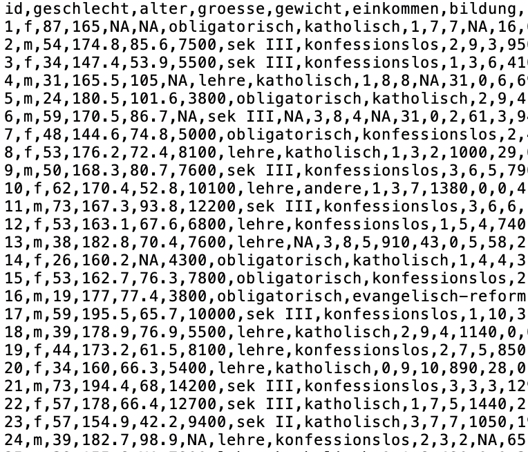

layout: true

<div class="my-footer">
  <span style="text-align:center">
    <span> 
      
    </span>
    <a href="https://cdsbasel.github.io/dataanalytics/">
      <span style="padding-left:82px"> 
        <font color="#7E7E7E">
          cdsbasel.github.io/dataanalytics/
        </font>
      </span>
    </a>
    <a href="https://cdsbasel.github.io/dataanalytics/">
      <font color="#7E7E7E">
       Data Analytics for Psychology and Business | February 2019
      </font>
    </a>
    </span>
  </div> 

---
  
```{r, eval = FALSE, echo = FALSE}
# Code to knit slides
xaringan::inf_mr('_sessions/D1S2_Wrangling/Wrangling.Rmd')
baselers <- read_csv("https://raw.githubusercontent.com/therbootcamp/baselers/master/inst/extdata/baselers.txt")


```

```{r setup, include=FALSE}
options(htmltools.dir.version = FALSE)
options(width=110)
options(digits = 4)
library(tidyverse)
baselers <- read_csv("https://raw.githubusercontent.com/therbootcamp/baselers/master/inst/extdata/baselers.txt")
```


# Datentypen ausserhalb von R

<table class="tg"  style="cellspacing:0; cellpadding:0; border:none;" width="95%">
<col width=30%>
<col width=30%>
<col width=30%>
<tr>
  <td bgcolor = 'white' style='vertical-align:top'>
    <ul>
      <li class="m1"><span><high>Structured data</high>
        <ul class="level">
        <li><span>Delimiter separated: <mono>.csv</mono>, <mono>.txt</mono>, etc.</span></li>
        <li><span>Relational databases: <mono>SQL</mono></span></li>
        </ul>
        <br>
        </span></li>
      </ul>
    </td>
  <td bgcolor = 'white' style='vertical-align:top'>
    <ul>
      <li class="m2"><span><high>Semi-structured data</high>
        <ul class="level">
        <li><span>Markup: <mono>.xml</mono>, <mono>.xls</mono>, <mono>.html</mono> etc.</span></li>
        <li><span>Non markup: <mono>JSON</mono>, <mono>MongoDB</mono></span></li>
        </ul>
        <br>
        </span></li>
      </ul>
    </td>
  <td bgcolor = 'white' style='vertical-align:top'>
    <ul>
      <li class="m3"><span><high>Unstructued data</high>
        <ul class="level">
        <li><span>z.B. Text</span></li>
        </ul>
        <br><br><br><br><br2>
        </span></li>
      </ul>
    </td>
  </tr>
</table>


---

# Delimiter separated data 

.pull-left45[

<ul>
  <li class="m1"><span><high>Delimiter</high> separates columns.</span></li>
  <li class="m2"><span>Typically available as <high>local text file</high>.</span></li>
  <li class="m3"><span><high>data types</high> are inferred.</span></li>
</ul>

<br>
<p align="center">
  
</p>

]

.pull-right45[

<p align="center">
  
</p>

]

---

# Delimiter separated data 

.pull-left45[

<ul>
  <li class="m1"><span><high>Delimiter</high> separates columns.</span></li>
  <li class="m2"><span>Typically available as <high>local text file</high>.</span></li>
  <li class="m3"><span><high>data types</high> are inferred.</span></li>
</ul>

<br>
<p align="center">
  
</p>

]

.pull-right45[

```{r, echo = F, message=F}
require(tibble)
options(tibble.width = 35, tibble.max_extra_cols = 0, tibble.print_max = 3,
        tibble.print_min = 5)
```


```{r, message = F}
# Lese Basel Datensatz ein
basel <- read_csv("1_Data/basel.csv")

# Benutze expliziten Delimiter
basel <- read_delim("1_Data/basel.csv",
                   delim = ",")
basel

```

]

---

# Identify file path 

.pull-left45[

<ul>
  <li class="m1"><span>Identify file path using RStudio's <high>auto-complete</high>.</span></li>
  <li class="m2"><span>Place cursor between quotation marks and press <highm>tab</highm>.</span></li>
</ul>

<p align="center">
  </img>
</p>

] 

.pull-right45[

<p align="center">
  </img>
</p>

]

---

# Den Filepath finden

.pull-left45[

<ul>
  <li class="m1"><span>Identify file path using RStudio's <high>auto-complete</high>.</span></li>
  <li class="m2"><span>Place cursor between quotation marks and press <highm>tab</highm>.</span></li>
</ul>

<p align="center">
  </img>
</p>

] 

.pull-right45[

<p align="center">
  </img>
</p>

]

---

# Inferred data types 

.pull-left45[


```{r}
# Read basel data set
basel <- read_csv("1_Data/basel.csv")
```

]

.pull-right45[

</image>

]

---

# Inferred data types 

.pull-left45[

<ul>
  <li class="m1"><span>Sometimes <mono>readr</mono> needs a little help to <high>correctly identify data types</high>.</span></li>
</ul>


```{r, eval = F}
# Explicitly define missing values
basel <- read_csv("1_Data/basel.csv",
                  na = c('NA'))

# Re-infer data types
basel <- type_convert(basel)
```
]

.pull-right45[

</image>

]

---

# Semi-structured data <font style="font-size: 16px">mit <a href="https://github.com/r-lib/xml2"><mono>xml2</mono></a> und <a href="https://github.com/hadley/rvest"><mono>rvest</mono></a></font> 

```{r, echo = F, message=F}
library(xml2) ; library(rvest) ; library(tibble)
options(max.print=100, width=220,tibble.width = 90,tibble.print_min = 10)
```

```{r, message=F}
# Load table from Wikipedia (with xml2 and rvest)
read_html("https://en.wikipedia.org/wiki/R_(programming_language)") %>%
  html_node(xpath = '//*[@id="mw-content-text"]/div/table[2]') %>%
  html_table() %>% as_tibble()
```


---

# Other data <font style="font-size: 16px">siehe <a href="https://cran.r-project.org/web/packages/rio/vignettes/rio.html">rio</a></font>

.pull-left45[
### `readr`  
```{r, eval = F}
# read fixed width files (can be fast)
data <- read_fwf(file, ...)

# read Apache style log files
data <- read_log(file, ...)

```

### `haven` 
```{r, eval = F}
# read SAS's .sas7bat and sas7bcat files
data <- read_sas(file, ...)

# read SPSS's .sav files
data <- read_sav(file, ...)

# etc
```
]

.pull-right45[
### `readxl` 
```{r, eval = F}
# read Excel's .xls and xlsx files
data <- read_excel(file, ...)
```
<br>
### Other
```{r, eval = F}
# Read Matlab .mat files
data <- R.matlab::readMat(file, ...)

# Read and wrangle .xml and .html
data <- XML::xmlParseParse(file, ...)

# from package jsonlite: read .json files
data <- jsonlite::read_json(file, ...)
```
]

---

# What is Wrangling?

<p align = "center">
<br>
<font style="font-size:10px">from <a href="https://datasciencebe.com/tag/data-wrangling/">datasciencebe.com</a></font>
</p>


---

.pull-left45[

# This is Wrangling!

<ul>
  <li class="m1"><span><high>Transform</high>
  <br><br>
  <ul class="level">
    <li><span>Rename columns names</span></li>
    <li><span>Create new variables</span></li>
  </ul></span></li>
  <li class="m2"><span><high>Organize</high>
  <br><br>
  <ul class="level">
    <li><span>Sort</span></li>
    <li><span>Join data sets</span></li>
    <li><span>Flip columns and rows</span></li>
  </ul></span></li>
  <li class="m3"><span><high>Aggregate</high>
  <br><br>
  <ul class="level">
    <li><span>Create groups</span></li>
    <li><span>Calculate statistics for groups</span></li>
  </ul></span></li>
</ul>


]

.pull-right5[
<br>
<p align="center">

</p>

]

---


.pull-left4[

# 2 'dirty' data sets

<ul>
  <li class="m1"><span><high>Rename</high>: Add intuitive column names</span></li>
  <li class="m2"><span><high>Recode</high>: Change to appropriate units.</span></li>
  <li class="m3"><span><high>Join</high>: Join datasets.</span></li>
  <li class="m4"><span><high>Sort</high>: Sort datasets.</span></li>
  <li class="m5"><span><high>Filter</high>: Select relevant cases.</span></li>
  <li class="m6"><span><high>Select</high>: Select relevant variables.</span></li>
</ul>

]

.pull-right45[

<br>

```{r, echo = F}
patients <- tibble(id = c(1, 2, 3, 4, 5),
                    X1 = c(37, 65, 57, 34, 45),
                    X2 = c(1, 2, 2, 1, 2))

```

```{r}
patients
```


```{r, echo = F}
results  <- tibble(id = c(4, 92, 1, 2, 99),
                     t_1 = c(100, 134, 123, 143, 102),
                     t_2 = c(105, 150, 135, 140,68))
```

```{r}
results
```

]


---

# The mighty `tidyverse`

The [`tidyverse`](https://www.tidyverse.org/) is a collection of high-performing, user-friendly R packages, created explicitly for efficient data analytics. 
1. `ggplot2` for graphics
2. <high><mono>dplyr</mono> for data wrangling</high>.
3. <high><mono>tidyr</mono> for data wrangling</high>.
4. `readr` for data I/O.
5. `purrr` for function programming.
6. `tibble` for modern `data.frame`s.
<br><br>

<table style="cellspacing:0; cellpadding:0; border:none;">
  <col width="15%">
  <col width="15%">
  <col width="15%">
  <col width="15%">
  <col width="15%">
  <col width="15%">
  <tr>
    <td bgcolor="white">
    </img>
    </td>
        <td bgcolor="white">
    </img>
    </td>
    <td bgcolor="white">
    </img>
    </td>
    <td bgcolor="white">
    </img>
    </td>
    <td bgcolor="white">
    </img>
    </td>
    <td bgcolor="white">
    </img>
    </td>
  </tr>
</table>

---

# <mono>`%>%`</mono>

.pull-left45[

<ul>
  <li class="m1"><span>The preferred way of using `dplyr` includes a <high>novel operator</high>, the pipe <highm>%>%</highm>.</span></li>
</ul>

<br>

<p align="center">
  <br>
<font style="font-size:10px">from <a href="https://upload.wikimedia.org/wikipedia/en/thumb/b/b9/MagrittePipe.jpg">wikimedia.org</a></font>
</p>

]

.pull-right45[


```{r}
# Numerical vector
score <- c(8, 4, 6, 3, 7, 3)
score

# mean: Base-R-style
mean(score)

# mean: dplyr-style
score %>%  
  mean()  
```


]


---

# `%>%`

.pull-left45[

<ul>
  <li class="m1"><span>The preferred way of using `dplyr` includes a <high>novel operator</high>, the pipe <highm>%>%</highm>.</span></li>
</ul>

<br>

<p align="center">
  <br>
<font style="font-size:10px">from <a href="https://upload.wikimedia.org/wikipedia/en/thumb/b/b9/MagrittePipe.jpg">wikimedia.org</a></font>
</p>


]

.pull-right45[

<p align="center">
  
</p>

]

---


.pull-left4[

# Transform

<ul>
  <li class="m1"><span><high>Rename</high>: Choose intuitive column names.
  <br><br>
  <ul class="level">
    <li><span><mono>rename()</mono></span></li>
  </ul>
  </span></li>
  <li class="m2"><span><high>Recode</high>: Choose appropriate units and labels. 
  <br><br>
  <ul class="level">
    <li><span><mono>mutate()</mono></span></li>
    <li><span><mono>case_when()</mono></span></li>
  </ul>
  </span></li>
  <li class="m3"><span><high>Join</high>: Join datasets
  <br><br>
  <ul class="level">
    <li><span><mono>left_join()</mono></span></li>
  </ul>
  </span></li>
</ul>

]

.pull-right45[

<br>

```{r, echo = F}
patients <- tibble(id = c(1, 2, 3, 4, 5),
                    X1 = c(37, 65, 57, 34, 45),
                    X2 = c(1, 2, 2, 1, 2))

```

```{r}
patients
```


```{r, echo = F}
results  <- tibble(id = c(4, 92, 1, 2, 99),
                   t_1 = c(100, 134, 123, 143, 102),
                   t_2 = c(105, 150, 135, 140,68))
```

```{r}
results
```

]

---

# `rename()` 

.pull-left45[

```{r, eval = FALSE, echo = TRUE}
patients %>%
  rename(NEW = OLD,
         NEW = OLD)
```

]

.pull-right45[

```{r}
# Starte mit Datensatz
patients %>% 

# Ändere Spaltennamen
  rename(age = X1,
         condition = X2)
```


]

---

# `mutate()` 

.pull-left45[

```{r, eval = FALSE}
tibble %>%
  mutate(
   NAME1 = DEFINITION1,
   NAME2 = DEFINITION2,
   NAME3 = DEFINITION3,
   ...
  )
```
]

.pull-right45[

```{r, warning = FALSE}
patients %>% 
  rename(age = X1, 
         condition = X2) %>%
  
# Kreiere neue Variablen
  mutate(monate = age * 12,
         dekaden = age / 10)
```

]

---

# `case_when()`

.pull-left45[

```{r, eval = FALSE}
tibble %>%
  mutate(
    NAME = case_when(
      LOGICAL1 ~ VALUE1,
      LOGICAL2 ~ VALUE2,
      ...
      )
    )

```


]

.pull-right45[

```{r}
patients %>% 
  rename(age = X1, 
         condition = X2) %>%
  
# Create cond_label from condition
  mutate(cond_label = case_when(
    condition == 1 ~ "placebo",
    condition == 2 ~ "medication"))
```

]

---

# Join datasets
 
<p align="center">
  
</p> 


---

# `inner_join()`

.pull-left4[

```{r, eval = FALSE}
TIBBLE1 %>%
  inner_join(TIBBLE2, 
             by = c("KEY"))
```

]

.pull-right5[

```{r,error=TRUE}
patients %>% 
  rename(age = X1, condition = X2) %>%
  mutate(cond_label = case_when(
    condition == 1 ~ "placebo",
    condition == 2 ~ "medication")) %>%
  
  # Verbinde mit ergebnisse
  inner_join(ergebnisse, by = "id")
```
]

---

# `left_join()`

.pull-left4[

```{r, eval = FALSE}
TIBBLE1 %>%
  left_join(TIBBLE2, 
            by = c("KEY"))
```

]

.pull-right5[

```{r,error=TRUE}
patients %>% 
  rename(age = X1, condition = X2) %>%
  mutate(cond_label = case_when(
    condition == 1 ~ "placebo",
    condition == 2 ~ "medication")) %>%
  
  # Verbinde mit ergebnisse
  left_join(ergebnisse, by = "id")
```
]

---

# Organize

.pull-left4[

<ul>
  <li class="m4"><span><high>Sortieren</high>: Sort data.
  <br><br>
  <ul class="level">
    <li><span><mono>arrange()</mono></span></li>
  </ul>
  </span></li>
  <li class="m5"><span><high>Filtern</high>: Select relevant cases.
  <br><br>
  <ul class="level">
    <li><span><mono>slice()</mono></span></li>
    <li><span><mono>filter()</mono></span></li>
  </ul>
  </span></li>
  <li class="m6"><span><high>Auswählen</high>: Select relevant variables.
  <br><br>
  <ul class="level">
    <li><span><mono>select()</mono></span></li>
  </ul>
  </span></li>
</ul>

]

.pull-right55[

```{r,echo=FALSE}
patient_results = patients %>% 
  rename(age = X1, condition = X2) %>%
  mutate(cond_label = case_when(
    condition == 1 ~ "placebo",
    condition == 2 ~ "medication")) %>%
  
  # Join with results
  left_join(results, by = "id")
```


```{r}
# Joined tibble
patient_results
```


]

---

# `arrange()`

.pull-left4[

```{r, echo = TRUE, eval = FALSE}
# Sort ascending
tibble %>%
  arrange(VAR1, VAR2)

# Sort descending (with desc())
tibble %>%
  arrange(desc(VAR1), VAR2)
```

]

.pull-right5[
```{r}
patient_results %>%
  
  # Sort according to condition
  arrange(condition)
```

]

---

# `arrange()`

.pull-left4[

```{r, echo = TRUE, eval = FALSE}
# Sort ascending
tibble %>%
  arrange(VAR1, VAR2)

# Sort descending (with desc())
tibble %>%
  arrange(desc(VAR1), VAR2)
```
]

.pull-right5[

```{r}
patient_results %>%
  
  # Sort according to both
  arrange(condition, age) 
```

]


---

# `slice()`

.pull-left4[

```{r, eval = F}
# Slice with sequence
patient_results %>%
  slice(INDEX_START:INDEX_STOP)

# Slice with vector  
patient_results %>%
  slice(c(INDEX1, INDEX2, ...))
```


]

.pull-right5[

```{r}
patient_results %>%
  arrange(condition, age) %>%

# Lines 3 and 5 
  slice(c(3, 5))
```


]

---

# `slice()`

.pull-left4[

```{r, eval = F}
# Slice with sequence
patient_results %>%
  slice(INDEX_START:INDEX_STOP)

# Slice with vector  
patient_results %>%
  slice(c(INDEX1, INDEX2, ...))
```

]

.pull-right5[

```{r}
patient_results %>%
  arrange(condition, age) %>%

# First 4 rows
  slice(1:4)
```

]

---

# `filter()`

.pull-left4[

```{r, eval = F}
patient_results %>%
  filter(VAR1 == VALUE1,
         VAR2 > VALUE2,
         VAR3 < VALUE3,
         VAR4 == VALUE4 | VAR5 < VALUE5)
```
]

.pull-right5[

```{r}
patient_results %>%
  
  # Patients with age > 35
  filter(age > 35)
```

]


---

# `filter()`

.pull-left4[

```{r, eval = F}
patient_results %>%
  filter(VAR1 == VALUE1,
         VAR2 > VALUE2,
         VAR3 < VALUE3,
         VAR4 == VALUE4 | VAR5 < VALUE5)
```

]

.pull-right5[

```{r}
# Age larger 35 & cond_label is medication
patient_results %>%
  filter(age > 35,
         cond_label == "medication")
```

]


---

# `select()`

.pull-left4[

```{r, eval = FALSE}
# Select variables
tibble %>% 
  select(VAR1, VAR2)

# Select all but  one variable
tibble %>% 
  select(-VAR1)
```

]

.pull-right5[

```{r}
patient_results %>%
  
  # Select id and condition
  select(id, condition)
```

]

---

# `select()`

.pull-left4[

```{r, eval = FALSE}
# Select variables
tibble %>% 
  select(VAR1, VAR2)

# Select all but one variable
tibble %>% 
  select(-VAR1)
```


]

.pull-right5[

```{r}
patient_results %>%
  
  # Everything but id
  select(-id)
```

]

---

# `starts_with()`

.pull-left4[

```{r, eval = FALSE}
# Select variables
tibble %>% 
  select(starts_with("PATTERN"))

```


]

.pull-right5[

```{r}
patient_results %>%
  
  # Select variables starting with "t"
  select(starts_with("t"))

```

]

---

# `contains()`

.pull-left4[


```{r, eval = FALSE}
# Select variables
tibble %>% 
  select(contains("PATTERN"))

```

]

.pull-right5[

```{r}
patient_results %>%
  
  # Select variables that contain "-"
  select(contains("_"))

```

]

---

# `pivot_longer()`

.pull-left4[

```{r, eval = F}
# wide to long
tibble %>% 
  pivot_longer(cols = VARS,
               names_to = NAME1,
               values_to = NAME2)
```

]

.pull-right5[

```{r}
# wide to long
patient_results %>% 
  filter(cond_label == "placebo")

```
]

---

# `pivot_longer()`

.pull-left4[

```{r, eval = F}
# wide to long
DATA %>% 
  pivot_longer(cols = VARS,
               names_to = NAME1,
               values_to = NAME2)
```

]

.pull-right5[

```{r}
# wide to long
patient_results %>% 
  filter(cond_label == "placebo") %>%
  pivot_longer(cols = c("t_1", "t_2"),
               names_to = "zeit",
               values_to = "messung")
```

]

---


# `pivot_wider()`

.pull-left4[

```{r, eval = F}
# long to wide
tibble %>% 
  pivot_wider(names_from = VAR1,
              values_from = VAR2)
```
]

.pull-right5[

```{r, echo = FALSE}
# long to wide
patient_results_lang <- patient_results %>% 
  filter(cond_label == "placebo") %>%
  pivot_longer(cols = c("t_1", "t_2"),
               names_to = "zeit",
               values_to = "messung")
```

```{r}
# long to wide
patient_results_lang
```

]

---


# `pivot_wider()`

.pull-left4[

```{r, eval = F}
# long to wide
tibble %>% 
  pivot_wider(names_from = VAR1,
              values_from = VAR2)
```
]

.pull-right5[

```{r, echo = FALSE}
# long to wide
patient_results_lang <- patient_results %>% 
  filter(cond_label == "placebo") %>%
  pivot_longer(cols = c("t_1", "t_2"),
               names_to = "zeit",
               values_to = "messung")
```

```{r}
# long to wide
patient_results_lang %>%
    pivot_wider(names_from = "zeit",
                values_from = "messung")
```

]

---

# Aggregate

.pull-left4[

<ul>
  <li class="m1"><span><high>Aggregate</high>
  <br><br>
  <ul class="level">
    <li><span><mono>summarise()</mono></span></li>
    <li><span><mono>summarise_if()</mono></span></li>
    <li><span><mono>group_by(), summarise()</mono></span></li>
    <li><span><mono>n(), first(), last(), nth()</mono></span></li>
    <li><span><mono>pull()</mono></span></li>
  </ul>
  </span></li>
</ul>

]

.pull-right5[

```{r, echo=F}
options(tibble.width=40, tibble.print_max=5, tibble.print_min=5, tibble.max_extra_cols=10)
```

```{r}
patient_results
```


]


---


# `summarise()`

.pull-left4[


```{r, echo = TRUE, eval = FALSE}
tibble %>%
  summarise(
    NAME1 = SUMMARY_FUN(VAR1),
    NAME2 = SUMMARY_FUN(VAR2)
  )
```


]

.pull-right5[

```{r}
patient_results %>%
  
  # descriptive stats
  summarise(
    mean_age = mean(age),
    median_t1 = median(t_1, 
                       na.rm = TRUE)
  )
```


]

---

# Grouped Aggregation

<p align="center">
  
</p> 


---

# `group_by()`, `summarise()`

.pull-left4[

```{r, eval = F}
tibble %>%
  group_by(GROUP_VAR) %>%
  summarise(
    NAME1 = SUMMARY_FUN(VAR1),
    NAME2 = SUMMARY_FUN(VAR2)
  )
```


]

.pull-right5[

```{r}
patient_results %>%
  
  # Group according to cond
  group_by(cond_label) %>%
  
  # Descriptive stats
  summarise(
    mean_age = mean(age),
    median_t1 = median(t_1, 
                       na.rm = TRUE)
  )
```

]

---

# `n()`

.pull-left4[

```{r, eval = F}
tibble %>%
  group_by(GRUPPEN_VAR) %>%
  summarise(
    NAME1 = SUMMARY_FUN(VAR1),
    NAME2 = SUMMARY_FUN(VAR2)
  )
```


]

.pull-right5[

```{r, echo=F}
options(tibble.width=50, tibble.print_max=5, tibble.print_min=5, tibble.max_extra_cols=10)
```


```{r}
patient_results %>%
  
  # Group according to cond
  group_by(cond_label) %>%
  
  # Descriptive stats
  summarise(
    N = n()
  )
```

]


---

class: middle, center

<h1><a href="https://therbootcamp.github.io/R4DS_2019Feb/_sessions/Wrangling/Wrangling_practical.html">Practical</a></h1>

